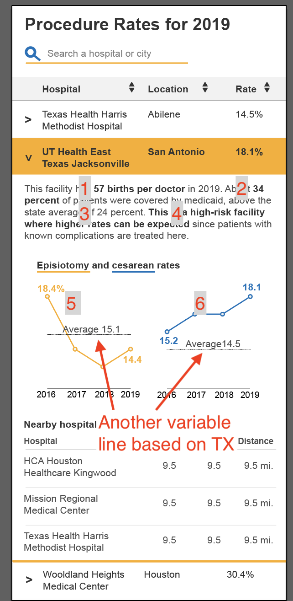
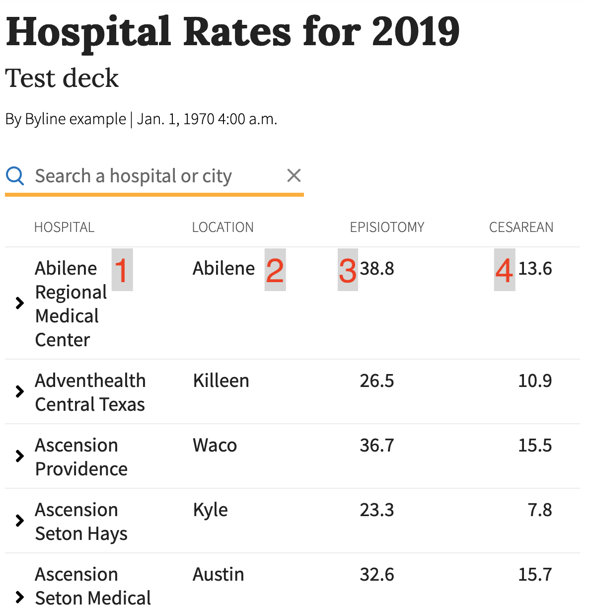

---
output:
  html_document:
    df_print: paged
knit: (function(inputFile, encoding) { rmarkdown::render(
    inputFile,
    encoding = encoding,
    output_dir = "docs",
    output_file='interactive.html'
  ) })
---

# Data for interactives

The purpose of this file is to identify different data points for interactives.

> Notes: All hospital values are == THCIC_ID.

- 1: blurbs_2019[DELSPERWK] (Births per week on average)
- 2: blurbs_2019[MCRATE]
- 3: summary_data[VALUE] (YR == 2019, SUMMARY == TX, CATEGORY == MEDICAID, MEASUREMENT == RATE). **The value is currently 44.6%.**
- 4: blurbs_2019[LEVEL] (The actual level based on [DSHS data](https://www.dshs.texas.gov/emstraumasystems/maternalfacilities.aspx) which I put into a spreadsheet.)
- 5: chart_data[EPIRATE]
- 6: chart_data[PCRATE]
- Average: chart_data: THCIC_ID == TX. Value is [EPIRATE] and [PCRATE]

- 1: table_2019[PROVIDER_NAME]
- 2: table_2019[PROVIDER_LOCATION]
- 3: table_2019[PCRATE]
- 4: table_2019[EPIRATE]

