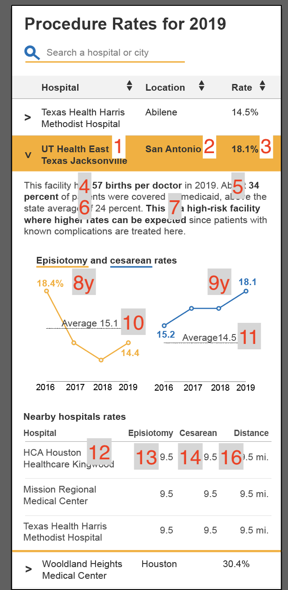

---
output:
  html_document:
    df_print: paged
knit: (function(inputFile, encoding) { rmarkdown::render(
    inputFile,
    encoding = encoding,
    output_dir = "docs",
    output_file='interactive.html'
  ) })
---

# Data for interactives

The purpose of this file is to identify different data points for interactives.

All hosp_sums_2019 values are == THCIC_ID.

- 1: hosp_sums_2019[PROVIDER_NAME]
- 2: hosp_sums_2019[PROVIDER_CITY]
- 3: hosp_sums_2019[ECRATE]
- 4: hosp_sums_2019[DELSPERWK] (Phrase should not display if value missing)
- 5: hosp_sums_2019[MCRATE]
- 6: summary_data[VALUE] (YR == 2019, SUMMARY == TX, CATEGORY == MEDICAID, MEASUREMENT == MEAN OF RATE) **I don't have this value calculated yet**.
- 7: ??
- 8y: lf_epi_rate_hosp_yr[EPIRATE] (Match YR, THCIC_ID). **I could remove other values?**
- 9y: ahrq_pcsec_rate_hosp_yr[PCRATE] (Match YR, THCIC_ID).  **I could remove other values?**
- 10: summary_data[VALUE] (YR == 2019, SUMMARY == TX, CATEGORY == EPISIOTOMY, MEASUREMENT == MEAN_OF_RATE)
- 11: summary_data[VALUE] (YR == 2019, SUMMARY == TX, CATEGORY == PRIMARY_CESAREAN, MEASUREMENT == MEAN OF RATE)
- 12: hosp_sums_2019[PROVIDER_NAME]
- 13: hosp_sums_2019[ERATE] (This is 2019 rate all deliveries)
- 14: hosp_sums_2019[CRATE] (This is 2019 rate all deliveries)
- 15: skipped
- 16: ???
